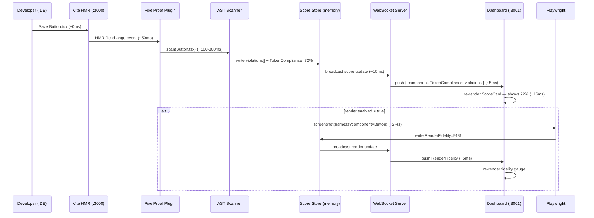

# PixelProof v1.0 — Architecture Decision Document

**Stack locked:** Node 18+, @babel/parser + @babel/traverse, postcss + postcss-scss, Playwright Chromium, pixelmatch, React + Vite, Figma REST API + local JSON cache.

---

## Q1 — Repo and Folder Structure

### `.pixelproof/` inside a user's project

```
.pixelproof/
  token-cache.json        # Resolved Figma token map — GITIGNORED by default (added on first run)
  screenshots/            # Playwright captures — always gitignored
  baselines/              # Figma-derived reference renders — always gitignored
  logs/
    last-run.json         # Structured log of last scan (violations + scores)
```

**ADR-OQ-04 — Token cache gitignore:** Gitignored by default. PixelProof appends `.pixelproof/` to `.gitignore` on first run. Token cache contains Figma file structure — treated as sensitive. Developers can opt-in to committing it explicitly (shared cache use case documented in README).

### PixelProof npm package internal structure

```
pixelproof/
  bin/
    pixelproof.js         # CLI entry — `npx pixelproof`
  src/
    cli/
      index.ts            # Commander.js: `start`, `sync`, `install` commands
    ast/
      scanner.ts          # Orchestrates file glob + engine dispatch
      engines/
        jsx-style.ts      # JSX style prop visitor
        styled-components.ts
        emotion.ts
        css-module.ts     # postcss parser
        vanilla-extract.ts
      whitelist.ts        # False-positive exclusions
    tokens/
      figma-client.ts     # Figma REST API (PAT auth, rate-limit aware)
      resolver.ts         # Alias chain resolver
      cache.ts            # Read/write .pixelproof/token-cache.json
      converter.ts        # DTCG / Style Dictionary / Token Studio → internal format
    render/
      harness-server.ts   # Vite dev server on :3001 with virtual entry injection
      provider-detector.ts # AST scan of App.tsx/main.tsx for context providers
      playwright-runner.ts # Screenshot capture + pixelmatch diff
    scoring/
      token-compliance.ts
      render-fidelity.ts
    dashboard/
      # React + Vite app (bundled into package)
      src/
        App.tsx
        components/
          ComponentCard.tsx
          ViolationList.tsx
          ScoreGauge.tsx
      vite.config.ts
    ipc/
      ws-server.ts        # WebSocket: pushes score updates to dashboard
  dist/                   # Compiled package output
  dashboard-dist/         # Pre-built dashboard static assets
```

---

## Q2 — AST Engine Algorithm

### Babel node types visited

| Source type | Babel visitor |
|---|---|
| JSX style prop | `JSXAttribute` → check `name.name === 'style'` |
| styled-components | `TaggedTemplateExpression` → tag matches `/^styled\.|^css$/` |
| Emotion css prop | `JSXAttribute` → check `name.name === 'css'` |
| vanilla-extract | `CallExpression` → callee matches `style\|globalStyle\|recipe\|styleVariants` |
| CSS Modules | postcss `Declaration` walker (separate pipeline) |

### Detection per source type

**a) JSX style prop** `style={{ color: '#fff' }}`
```
Visit JSXAttribute where name.name === 'style'
  → value is JSXExpressionContainer
    → expression is ObjectExpression
      → for each Property:
          key.name ∈ CSS_STYLE_PROPS (color, background, fontSize, etc.)
          value is StringLiteral OR NumericLiteral
          value matches VALUE_PATTERN (hex, rgb, hsl, Npx, Nem, Nrem)
          value NOT in WHITELIST
          → emit Violation
```

**b) styled-components** `background: '#fff'`
```
Visit TaggedTemplateExpression where tag matches styled.*|css
  → extract TemplateLiteral quasis (static string portions)
  → concatenate quasi strings (ignore dynamic ${...} interpolations)
  → parse concatenated string with postcss
  → walk CSS Declarations → same value matching as CSS Modules
```

**c) Emotion css prop**
```
Visit JSXAttribute where name.name === 'css'
  → if JSXExpressionContainer with ObjectExpression → same as JSX style prop
  → if CallExpression (css`...` or css({...})) → unwrap and recurse
```

**d) CSS Modules** (`.module.css`, `.module.scss`)
```
postcss.parse(fileContent, { syntax: postcss-scss })
Walk Declaration nodes:
  prop ∈ CSS_STYLE_PROPS
  value matches VALUE_PATTERN AND NOT in WHITELIST
  → emit Violation with { file, line: decl.source.start.line }
```

**e) vanilla-extract** (`.css.ts`)
```
Babel parse .css.ts with TSX support
Visit CallExpression where callee.name ∈ ['style','globalStyle','recipe','styleVariants']
  → first arg is ObjectExpression → same as JSX style prop traversal
  → nested objects (variants) → recurse
```

### Violation object (in-memory)

```typescript
interface Violation {
  id: string            // sha1(file + line + found)
  file: string          // "src/components/Button/Button.tsx"
  line: number          // 42
  column: number        // 12
  prop: string          // "color"
  found: string         // "#FF5733"
  type: 'color' | 'spacing' | 'typography' | 'border-radius' | 'shadow'
  nearestToken: string  // "var(--color-primary-500)"
  figmaToken: string    // "colors/primary/500"
  resolvedValue: string // "#FF5733"
  source: 'jsx-style' | 'styled-components' | 'emotion' | 'css-module' | 'vanilla-extract'
  confidence: 'exact' | 'approximate'  // exact = value in token map; approximate = similar value
}
```

### False positive avoidance

**Static whitelist** (never flagged):
`transparent`, `inherit`, `currentColor`, `none`, `initial`, `unset`, `revert`, `auto`, `0`, `100%`, `white`, `black`

**Logic rule — ADR-OQ-07 (Precision Mode):** Only emit a violation if the raw value (`#FF5733`) appears in `token-cache.lookupByValue`. Values absent from the token map are not flagged — no ground truth exists for them and false positives destroy trust. Example: `color="#fff"` is a violation only if `#ffffff` exists in the Figma token map. Unknown values are intentionally ignored in v1.0.

---

## Q3 — Token Resolution

### Lookup map construction

Input: W3C DTCG `$value` / `$alias` JSON from Figma REST API.

**Alias resolution algorithm** (handles 3+ levels deep):
```
function resolve(key, tokenMap, chain = []):
  if key in chain: throw CyclicAliasError(chain)
  token = tokenMap[key]
  if token.$value starts with '{':
    aliasKey = token.$value.replace(/^\{|\}$/g, '')  // strip braces
    return resolve(aliasKey, tokenMap, [...chain, key])
  return { value: token.$value, chain: [...chain, key] }
```
Max depth enforced at 20 iterations as hard stop.

### Token cache JSON structure

```json
{
  "version": "1",
  "syncedAt": "2026-03-20T10:00:00Z",
  "figmaFileId": "abc123",
  "tokens": {
    "colors/brand/primary": {
      "resolvedValue": "#0050C0",
      "aliasChain": ["colors/brand/primary", "colors/blue/600"],
      "cssVar": "--color-brand-primary",
      "type": "color"
    }
  },
  "lookupByValue": {
    "#0050C0": ["colors/brand/primary", "colors/blue/600"]
  },
  "lookupByCssVar": {
    "--color-brand-primary": "colors/brand/primary",
    "--colors-blue-600": "colors/blue/600"
  }
}
```

`lookupByValue` is the primary key for AST violation matching.
`lookupByCssVar` enables Render Fidelity matching (CSS computed values → token names).

Both maps are pre-built at sync time — O(1) lookup during scan.

---

## Q4 — Scoring Formula

### Token Compliance %

```
N  = total style properties found by AST scanner
     (excluding whitelisted values, excluding dynamic expressions)
K  = violations (found value exists in lookupByValue → raw value used instead of token)
M  = N - K  (compliant properties)

TokenCompliance = round((M / N) * 100, 1)

Edge cases:
  N == 0 → score = 100 (no style properties found = no violations possible)
  Component not in scan include paths → excluded from aggregate
```

**ADR-OQ-03 — Flat scoring:** All token types weighted equally. No violation type is penalised more than another. Rationale: no real-usage data yet to justify weighting; flat scoring is honest and predictable. Weighted scoring deferred to v1.1 after observing real violation distributions.

### Render Fidelity %

PixelProof uses **pixel diff** (pixelmatch) as primary signal. Rationale: directly observable, framework-agnostic, matches user mental model ("does it look right?").

```
Screenshot A = Playwright capture of component in iframe harness
Screenshot B = Figma component exported PNG at matching viewport

pixelmatch(A, B, diffBuffer, width, height, { threshold: tolerance/255 })
  → returns D (different pixel count)

P = total pixel count (width × height)

RenderFidelity = round(((P - D) / P) * 100, 1)
```

**ADR-OQ-06 — Tolerance = 4px:** Default pixel tolerance set to 4 (overriding PRD's 2px suggestion). Rationale: 2px produces false positives on font rendering differences across OS (Windows ClearType vs macOS sub-pixel). 4px is the Chromatic default and matches industry practice. Per-component override available via `.pixelproofrc` `render.tolerance`.

**Render skipped components:** Excluded from aggregate Render Fidelity calculation entirely.
- They do NOT contribute a 0% to the average — they are not counted.
- `aggregate = sum(RenderFidelity for rendered components) / count(rendered components)`
- Dashboard shows: "Render Fidelity: 87% (15 of 20 components rendered; 5 skipped — props required)"

---

## Q5 — Iframe Harness

### Zero-instrumentation architecture

PixelProof spawns its own Vite dev server on `:3001`. The server:
1. Reads the user project's `vite.config.ts` (if exists) and merges it as base config — inherits aliases, plugins, env handling.
2. Adds a **virtual module** `virtual:pixelproof-harness` as the Vite entry point. No files written to `src/`.
3. Virtual entry dynamically imports the target component by absolute path from `src/`.

```
# Harness URL pattern
localhost:3001/harness?component=src/components/Button/Button.tsx&export=Button
```

The iframe in the dashboard loads this URL. The virtual entry receives `component` + `export` query params, dynamic-imports the module, and renders the named export.

### Context provider injection

Detection strategy: AST scan of `src/main.tsx` (or `src/index.tsx`, `src/App.tsx`) at startup.

```
Scan main.tsx for JSXElements matching known provider patterns:
  ThemeProvider, Provider (react-redux), QueryClientProvider,
  RouterProvider, AuthProvider, I18nextProvider, ChakraProvider, MantineProvider

For each matched provider:
  → extract import source ("@mui/material", "react-redux", etc.)
  → extract props (static only — e.g., theme={theme} where theme is importable)
  → record as ProviderConfig { component, importPath, staticProps }
```

**ADR-OQ-08 — Auto-detect + explicit override:** Auto-detect known provider patterns at startup; allow override via `.pixelproofrc`. If auto-detect finds dynamic props → skip that provider and warn in dashboard: "ThemeProvider detected but props are dynamic — add `render.providers` to `.pixelproofrc` for full context."

Auto-detection generates a wrapping template in the virtual entry:
```tsx
import { ThemeProvider } from '@mui/material'
import { theme } from 'src/theme'  // detected import

export default function Harness({ Component }) {
  return <ThemeProvider theme={theme}><Component /></ThemeProvider>
}
```

Explicit override format in `.pixelproofrc`:
```yaml
render:
  providers:
    - "./src/providers/ThemeProvider"   # default export assumed
    - "./src/store/ReduxProvider"
```
Explicit list, when present, **replaces** auto-detection entirely for that project.

### Component render failure

Each component is wrapped in a React ErrorBoundary in the virtual harness entry. On throw:
- ErrorBoundary catches, logs error to `ws-server`
- Component marked `renderStatus: 'error'` in score store
- Dashboard shows error message inline on the component card
- Render Fidelity excluded from aggregate (same as skipped)

### Component selection

Dashboard → clicks component card → posts to WebSocket: `{ type: 'render-request', component: 'src/components/Button/Button.tsx', export: 'Button' }` → harness-server updates iframe URL → Playwright rescreens on next request.

---

## Q6 — End-to-End Data Flow

**Trigger:** Developer saves `Button.tsx` with `color: '#FF5733'` (token violation)



**Step timing summary:**

| Step | Duration |
|---|---|
| Vite detects save | ~50ms |
| AST rescan (single file) | ~100–300ms |
| Dashboard score update (token) | ~175–375ms total from save |
| Playwright screenshot | ~2–4s |
| pixelmatch diff | ~100–300ms |
| Dashboard fidelity update | ~2.5–4.5s total from save |

**What the dashboard shows after the save:**
- Token Compliance: drops from previous score to 72% (or whatever the new calculation yields)
- Violation list updates inline: `Button.tsx:42 — color: '#FF5733' → use var(--color-primary-500)`
- Render Fidelity: spinner while Playwright runs, then updates to new score
- No page reload required — WebSocket push + React state update only

---

## Architecture Decision Record (ADR) — All Resolved

| ID | Decision | Resolution |
|---|---|---|
| OQ-03 | Violation weighting | **Flat scoring.** All token types equal weight. Weighted scoring in v1.1 after real data. |
| OQ-04 | Gitignore token-cache.json | **Yes — gitignored by default.** Auto-appended to `.gitignore` on first run. Opt-in to commit. |
| OQ-05 | PAT detection priority | **Auto-detect both.** Order: `FIGMA_PAT` env var → `.env` file → `.pixelproofrc` explicit field. First found wins. Never prompted interactively. Never logged. |
| OQ-06 | Render fidelity tolerance | **4px default** (overrides PRD's 2px). Per-component override allowed via `.pixelproofrc`. |
| OQ-07 | Flag values not in token map | **Precision mode.** Only flag raw values that exist in `lookupByValue`. Unknown values not flagged. |
| OQ-08 | Provider injection | **Auto-detect + explicit override.** Explicit list in `.pixelproofrc` replaces auto-detection entirely. On dynamic props: warn in dashboard, render without provider. |
| NQ-02 | mockProps format | **Static objects only** in `.pixelproofrc` (JSON-compatible). No factory functions, no faker. Inline config only — no external mock file path in v1.0. TS factory functions in v1.1. |

---

## Scrum Master Handoff

To write Sprint 1 stories, read these documents in order:

1. **[project-context.md](_bmad-output/project-context.md)** — Product rules, scope boundaries, locked decisions, non-functional requirements. Read first. Fastest summary of all constraints.
2. **[prd.md](_bmad-output/planning-artifacts/prd.md)** — Full functional requirements, user personas, acceptance criteria per feature. Source of truth for "what the product does."
3. **[architecture.md](_bmad-output/planning-artifacts/architecture.md)** (this document) — Implementation blueprint. Every story that touches AST, tokens, scoring, harness, or data flow maps to a section here.

**Natural sprint decomposition from this architecture:**

| Sprint | Theme | Architecture sections |
|---|---|---|
| Sprint 1 | CLI scaffold + AST engine (JSX style prop only) | Q1 package structure, Q2a |
| Sprint 2 | Token sync + cache + violation matching | Q3 full, Q2 whitelist |
| Sprint 3 | Scoring + dashboard skeleton + WebSocket | Q4, Q6 (token path only) |
| Sprint 4 | Remaining CSS-in-JS engines | Q2b–Q2e |
| Sprint 5 | Iframe harness + provider detection | Q5 full |
| Sprint 6 | Playwright + pixelmatch + render fidelity score | Q4 render formula, Q6 render path |
